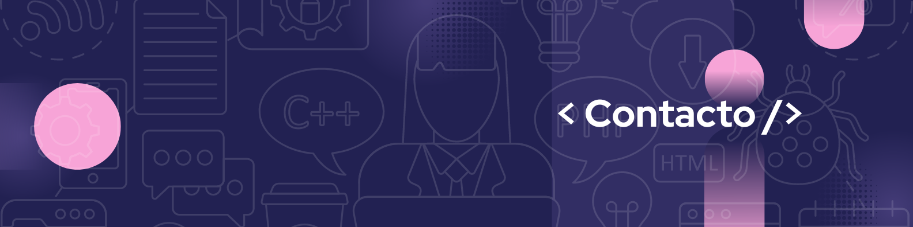

## 👩🏻‍💻 Mi Perfil 
### < Hola :earth_americas: mundo, soy Cecilia Perdomo! :computer: />

#### Sobre mi: 

- 📫 Soy de Colonia del Sacramento, Uruguay.
- 🔭 Soy curiosa, inquieta y me gusta aprender.
- 💻 Soy:
  -  Full Stack Software Developer
  - Analista programadora
  - Desarrolladora de aplicaciones móviles
  - Diseñadora UX/UI
  - Scrum Master
- :books: Me gusta leer y :headphones: escuchar música.

## 🛠️ Tecnologías que manejo

| Lenguajes | Frontend | Backend | Base de Datos | CMS / Servicios | Herramientas |
|----------|----------|---------|---------------|------------------|--------------|
|  |  |  |  |  |  |
|  |  |  |  |  |  |
|  |  |  |  |  |  |
|  |  |  |  | | |
|  |  |  |  | | |
|  |  |  |  | | |

| Nombre del proyecto | Curso | Tecnologías utilizadas | Github |
| :---         |     :---      |          :--- | :--- |
| StarWars | https://star-wars-next-js-firebase.vercel.app | Next.js, Firebase | https://github.com/CeciliaBPerdomo/StarWars-NextJs-Firebase |
| Mis Libritos | Desarrollo de aplicaciones | React Native, Redux, Firebase | https://github.com/CeciliaBPerdomo/18.ReactNative.ProyectoFinal |
| Electrodomésticos Capellari | Next.js | Next.js, Firebase | https://github.com/CeciliaBPerdomo/MicroDesafios-Nextjs |
| Activa Fitness Club | Full Stack Software Developer | React.js, Pyhton, SQLAlchemy | https://github.com/CeciliaBPerdomo/ActivaFitnessClub |
| Tienda Azul | Certificación Mercado Pago | React.js, Pyhton, API MP | https://github.com/CeciliaBPerdomo/MP-Tienda-Azul |
| E-Commerce | Programación Backend | Node.js, MondoDB | https://github.com/CeciliaBPerdomo/Ecommerce-ProyectoFinal |
| Farmacia | Programación Frontend | TypeScript | https://github.com/CeciliaBPerdomo/FarmaciaCP |

### Me puedes contactar mediante:
 
