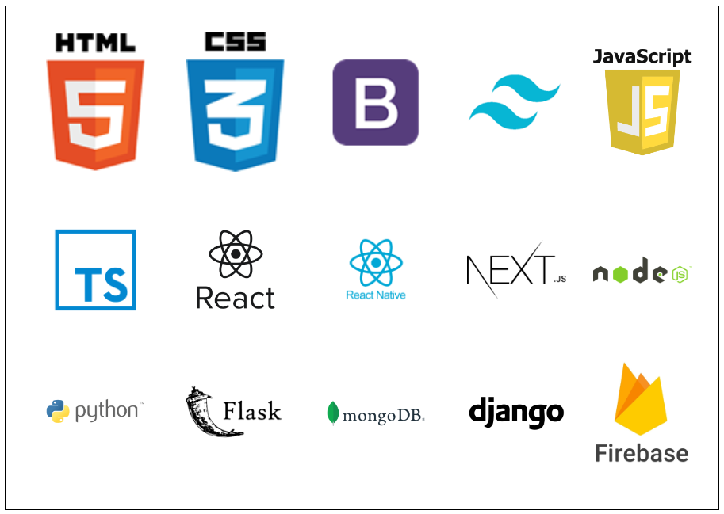

### < Hola :earth_americas: mundo, soy Cecilia Perdomo! :computer: />

#### Sobre mi: 

- 🌎 Soy de Colonia del Sacramento, Uruguay.
- 💎 Soy curiosa, inquieta y me gusta aprender.
- 💻 Soy:
  -  Full Stack Software Developer
  - Analista programadora
  - Desarrolladora de aplicaciones móviles
  - Diseñadora UX/UI
  - Scrum Master
- :books: Me gusta leer y :headphones: escuchar música.

<!--
  <tr align="center">
    <th>
      
    </th>
     <th>
      
    </th>
    <th>
      
Certificada por MercadoPago

      
    </th>
  </tr>  
</table>
--!> 

#### Me puedes contactar por: 
 

<!--

https://upload.wikimedia.org/wikipedia/ar/7/7a/Dino_Swords.gif) 
**CeciliaBPerdomo/CeciliaBPerdomo** is a ✨ _special_ ✨ repository because its `README.md` (this file) appears on your GitHub profile.

Here are some ideas to get you started:

- 🔭 I’m currently working on ...
- 🌱 I’m currently learning ...
- 👯 I’m looking to collaborate on ...
- 🤔 I’m looking for help with ...
- 💬 Ask me about ...
- 📫 How to reach me: ...
- 😄 Pronouns: ...
- ⚡ Fun fact: ...
-->
